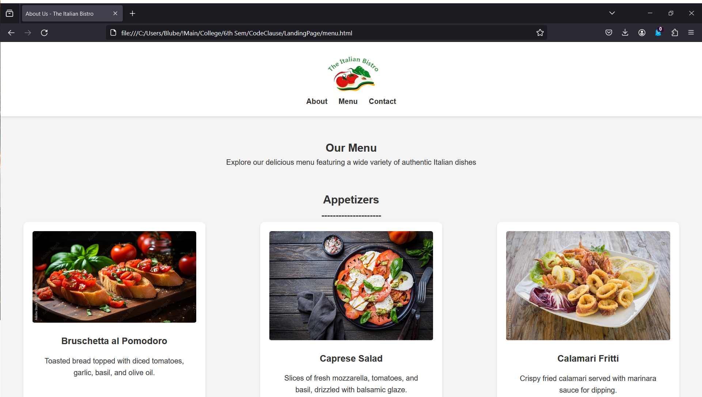

# Italian Bistro Landing Page

Welcome to the Italian Bistro Landing Page repository! This repository contains the source code and assets for the Italian Bistro landing page.

## Overview

The Italian Bistro landing page is a simple yet elegant web page designed to showcase the restaurant's offerings, menu, contact information, and allow users to book a table. It features responsive design elements and a user-friendly layout.

## Screenshots

Here are screenshots of the Italian Bistro landing page:

1. Home Page-  
2. Menu Section-  
3. Contact Section 
4. About Section- 

## Technologies Used

- HTML
- CSS

## Usage

To use the Italian Bistro landing page:

1. Clone this repository to your local machine.
2. Open the `home.html` file in your web browser to view the landing page.

## Contributing

Contributions are welcome! If you find any issues or have suggestions for improvements, feel free to open an issue or submit a pull request.

## License

This project is licensed under the MIT License - see the [LICENSE](LICENSE) file for details.
